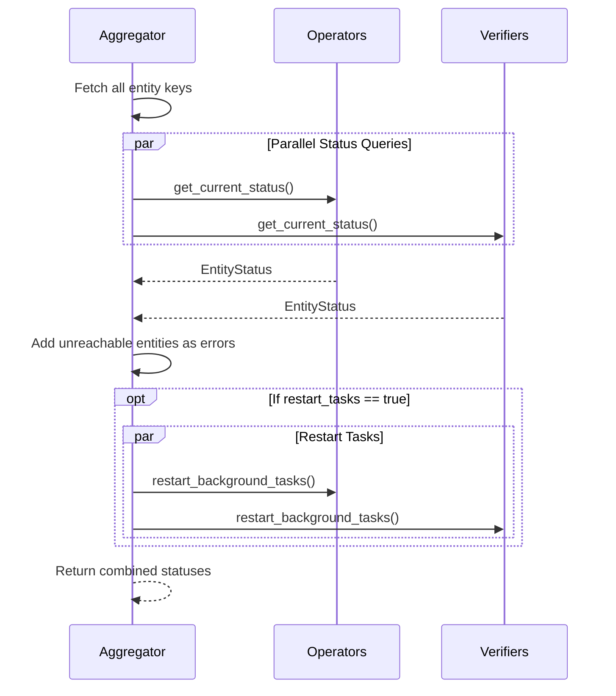
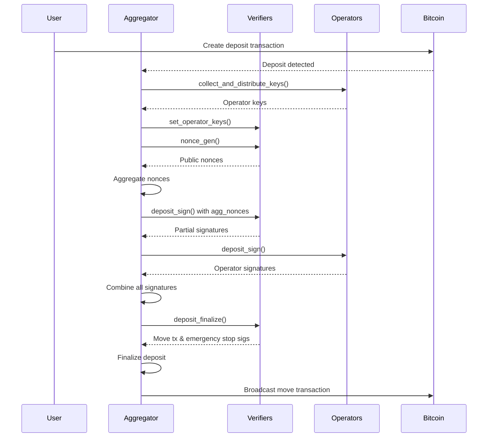

The Aggregator coordinates communication between verifiers and operators to finalize deposits. It collects cryptographic keys, distributes them to participants, aggregates signatures, and ensures all actors are compatible.

## Architecture

```rust
pub struct Aggregator {
    rpc: ExtendedBitcoinRpc,
    db: Database,
    config: BridgeConfig,
    tx_sender: TxSenderClient<Database>,
    operator_clients: Vec<ClementineOperatorClient<Channel>>,
    verifier_clients: Vec<ClementineVerifierClient<Channel>>,
    verifier_keys: Arc<RwLock<Vec<Option<PublicKey>>>>,
    operator_keys: Arc<RwLock<Vec<Option<XOnlyPublicKey>>>>,
}
```

### Key Components

- **RPC Clients**: gRPC connections to all verifiers and operators
- **Key Caches**: Thread-safe storage for collected public keys
- **Database**: Stores deposit states and compatibility data
- **Bitcoin RPC**: Queries blockchain state

## Core Responsibilities

### 1. Key Collection and Caching

The aggregator maintains caches of verifier and operator public keys to avoid repeated network calls:

```rust
async fn fetch_pubkeys_from_entities<T, C, F, Fut>(
    &self,
    clients: &[C],
    keys_storage: &RwLock<Vec<Option<T>>>,
    pubkey_fetcher: F,
    key_type_name: &str,
) -> Result<Vec<T>, BridgeError>
```

**Caching Strategy**:

1. **Check Cache**: If all keys are already collected, return immediately
2. **Parallel Fetch**: For missing keys, query entities in parallel
3. **Validate Uniqueness**: Ensure no duplicate keys across entities
4. **Update Cache**: Store successful results for future use
5. **Error Handling**: Return error only if not all keys could be collected

#### Verifier Key Collection

```rust
pub async fn fetch_verifier_keys(&self) -> Result<Vec<PublicKey>, BridgeError> {
    self.fetch_pubkeys_from_entities(
        &self.verifier_clients,
        &self.verifier_keys,
        |mut client| async move {
            let verifier_params = client.get_params(request).await?.into_inner();
            let public_key = PublicKey::from_slice(&verifier_params.public_key)?;
            Ok(public_key)
        },
        "verifier",
    ).await
}
```

**Timeout**: `PUBLIC_KEY_COLLECTION_TIMEOUT`

#### Operator Key Collection

```rust
pub async fn fetch_operator_keys(&self) -> Result<Vec<XOnlyPublicKey>, BridgeError> {
    self.fetch_pubkeys_from_entities(
        &self.operator_clients,
        &self.operator_keys,
        |mut client| async move {
            let operator_xonly_pk = client
                .get_x_only_public_key(request)
                .await?
                .into_inner()
                .try_into()?;
            Ok(operator_xonly_pk)
        },
        "operator",
    ).await
}
```

**Uniqueness Check**:

```rust
let unique_keys: HashSet<_> = non_none_keys.iter().cloned().collect();

if unique_keys.len() != non_none_keys.len() {
    // Reset cache and return error
    for key in keys.iter_mut() {
        *key = None;
    }
    return Err(eyre::eyre!("Keys are not unique: {keys:?}"));
}
```

### 2. Participating Entity Selection

For each deposit, the aggregator identifies which configured entities are participating:

#### Participating Verifiers

```rust
pub async fn get_participating_verifiers(
    &self,
    deposit_data: &DepositData,
) -> Result<ParticipatingVerifiers, BridgeError> {
    let verifier_keys = self.fetch_verifier_keys().await?;
    let mut participating_verifiers = Vec::new();
    
    for verifier_pk in deposit_data.get_verifiers() {
        if let Some(pos) = verifier_keys.iter().position(|key| key == &verifier_pk) {
            participating_verifiers.push((
                self.verifier_clients[pos].clone(),
                VerifierId(verifier_pk)
            ));
        } else {
            return Err(BridgeError::VerifierNotFound(verifier_pk));
        }
    }
    
    Ok(ParticipatingVerifiers::new(participating_verifiers))
}
```

**ParticipatingVerifiers** wrapper provides:
- `clients()`: Get RPC clients for all participating verifiers
- `ids()`: Get identifiers for logging and error messages

Same pattern applies to **ParticipatingOperators**.

### 3. Key Collection and Distribution

The aggregator orchestrates the complex process of collecting keys from operators and distributing them to verifiers:

```rust
pub async fn collect_and_distribute_keys(
    &self,
    deposit_params: &DepositParams,
) -> Result<(), BridgeError>
```

#### Workflow

<Steps>
  <Step title="Setup Broadcast Channels">
    Create channels for operator keys with capacity based on participant counts:
    ```rust
    let (operator_keys_tx, operator_keys_rx) =
        tokio::sync::broadcast::channel::<OperatorKeysWithDeposit>(
            num_operators * num_verifiers,
        );
    
    // Each verifier gets its own receiver
    let operator_rx_handles = (0..num_verifiers)
        .map(|_| operator_keys_rx.resubscribe())
        .collect();
    ```
  </Step>
  <Step title="Collect from Operators">
    Query all participating operators in parallel:
    ```rust
    let get_operators_keys_handle = tokio::spawn(timed_try_join_all(
        OPERATOR_GET_KEYS_TIMEOUT,
        "Operator key collection",
        Some(operator_ids),
        operator_clients.map(|mut operator_client| async move {
            let operator_keys = operator_client
                .get_deposit_keys(deposit_params.clone())
                .await?
                .into_inner();
            
            // Broadcast to all verifiers
            let _ = operator_keys_tx.send(OperatorKeysWithDeposit {
                deposit_params: Some(deposit_params),
                operator_keys: Some(operator_keys),
                operator_xonly_pk: operator_xonly_pk.serialize().to_vec(),
            });
            
            Ok(())
        }),
    ));
    ```
  </Step>
  <Step title="Distribute to Verifiers">
    Send collected keys to each verifier:
    ```rust
    let distribute_operators_keys_handle = tokio::spawn(timed_try_join_all(
        VERIFIER_SEND_KEYS_TIMEOUT,
        "Verifier key distribution",
        Some(verifier_ids),
        verifier_clients.zip(operator_rx_handles).map(
            |(mut verifier, mut rx)| async move {
                let mut received_keys = HashSet::new();
                
                // Wait for all operator keys
                while received_keys.len() < num_operators {
                    let operator_keys = rx.recv().await?;
                    
                    if received_keys.insert(operator_keys.operator_xonly_pk.clone()) {
                        verifier.set_operator_keys(operator_keys).await?;
                    }
                }
                
                Ok(())
            }
        ),
    ));
    ```
  </Step>
  <Step title="Wait for Completion">
    Both tasks must complete successfully:
    ```rust
    let (collect_result, distribute_result) = tokio::join!(
        get_operators_keys_handle,
        distribute_operators_keys_handle
    );
    
    flatten_join_named_results([
        ("get_operators_keys", collect_result),
        ("distribute_operators_keys", distribute_result),
    ])?;
    ```
  </Step>
</Steps>

**Timeout Handling**: If any operation exceeds its timeout, the entire process fails and no partial state is committed.

**Operator Keys Include**:
- BitVM assert Winternitz public keys
- Challenge acknowledgment hashes
- Deposit-specific commitments

### 4. Entity Status Monitoring

The aggregator provides a unified view of all entity statuses:

```rust
pub async fn get_entity_statuses(
    &self,
    restart_tasks: bool,
) -> Result<Vec<EntityStatusWithId>, BridgeError>
```

#### Status Collection



**Response Format**:

```rust
EntityStatusWithId {
    entity_id: Some(EntityId {
        kind: EntityType::Operator, // or Verifier
        id: xonly_pk.to_string(),
    }),
    status_result: Some(StatusResult::Status(EntityStatus {
        automation: true,
        wallet_balance: Some("0.1 BTC".to_string()),
        tx_sender_synced_height: Some(850000),
        finalized_synced_height: Some(849900),
        rpc_tip_height: Some(850010),
        bitcoin_syncer_synced_height: Some(850005),
        stopped_tasks: Some(stopped_tasks_list),
        // ...
    })),
}
```

**Unreachable Entities**: Added to response with error status:

```rust
EntityStatusWithId {
    entity_id: Some(EntityId {
        kind: EntityType::Verifier,
        id: "Index 3 in config (0-based)".to_string(),
    }),
    status_result: Some(StatusResult::Err(EntityError {
        error: "Verifier key was not able to be collected".to_string(),
    })),
}
```

### 5. Compatibility Checking

The aggregator ensures all actors are running compatible software versions:

```rust
pub async fn check_compatibility_with_actors(
    &self,
    scope: CompatibilityCheckScope,
) -> Result<(), BridgeError>
```

#### Compatibility Scopes

```rust
pub enum CompatibilityCheckScope {
    VerifiersOnly,   // Only check verifiers
    OperatorsOnly,   // Only check operators
    Both,            // Check both verifiers and operators
}
```

#### Compatibility Data Collection

```rust
pub async fn get_compatibility_data_from_entities(
    &self,
) -> Result<Vec<EntityDataWithId>, BridgeError> {
    let (operator_keys, verifier_keys) = self.fetch_all_entity_keys().await;
    
    // Query operators for compatibility params
    let operator_comp_data = join_all(
        operator_clients.map(|mut client| async move {
            let response = client.get_compatibility_params(request).await;
            EntityDataWithId {
                entity_id: Some(entity_id),
                data_result: match response {
                    Ok(response) => Some(DataResult::Data(response.into_inner())),
                    Err(e) => Some(DataResult::Error(e.to_string())),
                },
            }
        })
    ).await;
    
    // Same for verifiers...
    
    // Add aggregator's own compatibility data
    entities_comp_data.push(aggregator_comp_data);
    
    // Add errors for unreachable entities
    Self::add_unreachable_entity_errors(
        &mut entities_comp_data,
        &operator_keys,
        &verifier_keys,
        |entity_type, id, error_msg| { /* ... */ },
    );
    
    Ok(entities_comp_data)
}
```

#### Compatibility Validation

Implemented via the `CompatibilityParams` trait:

```rust
impl ActorWithConfig for Aggregator {
    fn get_compatibility_params(&self) -> Result<CompatibilityParams, BridgeError> {
        CompatibilityParams::from_config(&self.config)
    }
    
    fn is_compatible(
        &self,
        actors_compat_params: Vec<(String, CompatibilityParams)>,
    ) -> Result<(), BridgeError> {
        let my_params = self.get_compatibility_params()?;
        
        for (actor_id, actor_params) in actors_compat_params {
            if !my_params.is_compatible_with(&actor_params) {
                return Err(eyre::eyre!(
                    "Incompatible with {actor_id}: {:?}",
                    my_params.diff(&actor_params)
                ));
            }
        }
        
        Ok(())
    }
}
```

**Compatibility Criteria**:
- Protocol version
- Network (mainnet, testnet, regtest, etc.)
- Security council configuration
- Protocol parameters (bridge amount, collateral, etc.)
- BitVM parameters

**Error Aggregation**:

```rust
let (operator_results, operator_err) = join_all_partition_results(operator_futures).await;
let (verifier_results, verifier_err) = join_all_partition_results(verifier_futures).await;

if let Some(operator_err) = operator_err {
    errors.push(format!("Error retrieving operator params: {operator_err}"));
}

if let Err(e) = self.is_compatible(all_params) {
    errors.push(format!("Not compatible with some actors: {e}"));
}

if !errors.is_empty() {
    return Err(eyre::eyre!(errors.join("; ")));
}
```

## Background Tasks

### Aggregator Metric Publisher

Publishes metrics about aggregator and entity health:

```rust
AggregatorMetricPublisher::new(aggregator.clone())
    .await?
    .with_delay(AGGREGATOR_METRIC_PUBLISHER_POLL_DELAY)
```

**Metrics Collected**:
- Number of reachable operators
- Number of reachable verifiers
- Average sync status across entities
- Compatibility status
- Recent deposit activity

**Poll Interval**: `AGGREGATOR_METRIC_PUBLISHER_POLL_DELAY` (typically 30 seconds)

## Communication Patterns

### Deposit Coordination Flow



### Timeout Strategy

The aggregator uses different timeouts for different operations:

| Operation | Timeout | Constant |
|-----------|---------|----------|
| Public key collection | 30s | `PUBLIC_KEY_COLLECTION_TIMEOUT` |
| Operator key retrieval | 60s | `OPERATOR_GET_KEYS_TIMEOUT` |
| Verifier key distribution | 60s | `VERIFIER_SEND_KEYS_TIMEOUT` |
| Entity status polling | 10s | `ENTITY_STATUS_POLL_TIMEOUT` |
| Compatibility data | 15s | `ENTITY_COMP_DATA_POLL_TIMEOUT` |
| Restart background tasks | 30s | `RESTART_BACKGROUND_TASKS_TIMEOUT` |

## Error Handling

### Graceful Degradation

The aggregator continues operating even if some entities are unreachable:

**Key Collection**: Returns error only if ALL keys cannot be collected

```rust
let _ = self.fetch_operator_keys().await; // Don't fail
let _ = self.fetch_verifier_keys().await; // Don't fail

let operator_keys = self.operator_keys.read().await.clone();
let verifier_keys = self.verifier_keys.read().await.clone();

// Work with whatever keys are available
```

**Status Queries**: Unreachable entities are reported with error status, not fatal error

### Error Propagation

Errors that DO fail the operation:

- Deposit coordination: Any participant failure aborts deposit
- Compatibility check: Any incompatibility fails the check
- Key distribution: Timeout or partial delivery fails the operation

## Security Properties

### Key Validation

✅ **Ensures**:
- All verifier keys are unique
- All operator keys are unique
- Keys match expected deposit participants
- Stale keys are never used

### Deposit Coordination

✅ **Prevents**:
- Partial deposits with missing signatures
- Signature aggregation with wrong nonces
- Distribution of keys to non-participating verifiers

### Compatibility Enforcement

✅ **Detects**:
- Version mismatches across actors
- Network configuration differences
- Protocol parameter inconsistencies

## Performance Optimizations

### Parallel Operations

The aggregator maximizes parallelism:

```rust
// Collect from all operators in parallel
tokio::spawn(timed_try_join_all(/* operator futures */));

// Distribute to all verifiers in parallel
tokio::spawn(timed_try_join_all(/* verifier futures */));

// Both spawned tasks run concurrently
let (collect_result, distribute_result) = tokio::join!(handle1, handle2);
```

### Broadcast Channels

Using broadcast channels for operator key distribution:

```rust
let (tx, rx) = broadcast::channel(capacity);

// Each verifier gets its own receiver
let receivers: Vec<_> = (0..num_verifiers)
    .map(|_| rx.resubscribe())
    .collect();

// Operators broadcast once, all verifiers receive
for operator_keys in collected_keys {
    tx.send(operator_keys)?;
}
```

This is more efficient than point-to-point channels when distributing the same data to multiple recipients.

### Key Caching

Public keys are cached to avoid repeated network calls:

- First call: Fetch from all entities
- Subsequent calls: Return from cache immediately
- Cache invalidation: Only on error or explicit reset

## Related Documentation

<CardGroup cols={2}>
  <Card title="Actor Overview" icon="diagram-project" href="/actors/overview">
    Learn about the actor model architecture
  </Card>
  <Card title="Verifier" icon="shield-check" href="/actors/verifier">
    See how verifiers work with aggregator
  </Card>
  <Card title="Operator" icon="gears" href="/actors/operator">
    Understand operator coordination
  </Card>
</CardGroup>
