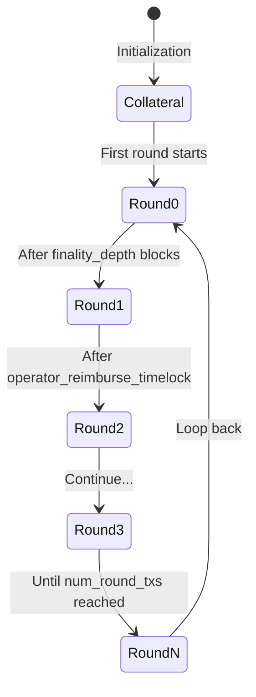

Operators manage collateral, process user withdrawals, and generate cryptographic commitments for the bridge protocol. They are financially incentivized actors who provide liquidity for withdrawals.

## Architecture

```rust
pub struct Operator<C: CitreaClientT> {
    rpc: ExtendedBitcoinRpc,
    db: Database,
    signer: Actor,
    config: BridgeConfig,
    collateral_funding_outpoint: OutPoint,
    reimburse_addr: Address,
    tx_sender: TxSenderClient<Database>,
    header_chain_prover: HeaderChainProver,
    citrea_client: C,
}
```

### Key Components

- **Bitcoin RPC**: Broadcasts transactions and monitors confirmations
- **Signer**: Actor instance for signing transactions
- **Database**: Tracks rounds, kickoff connectors, and deposits
- **Collateral UTXO**: Locked funds that secure operator behavior
- **Reimburse Address**: Where operators receive reimbursements
- **Header Chain Prover**: Generates SPV proofs for BitVM assertions

## Initialization

### Automatic Setup

When an operator starts for the first time:

<Steps>
  <Step title="Check Database">
    Look for existing operator data in database
  </Step>
  <Step title="Create Collateral UTXO">
    If no existing data, check config for `OPERATOR_COLLATERAL_FUNDING_OUTPOINT`:
    - If set: Validate it exists on-chain with correct amount and script
    - If not set: Create new UTXO by sending to operator's taproot address
    
    ```rust
    // Collateral must be a P2TR output with operator's xonly key
    let expected_script = signer.address.script_pubkey();
    let expected_amount = protocol_paramset.collateral_funding_amount;
    ```
  </Step>
  <Step title="Set Reimburse Address">
    Use `OPERATOR_REIMBURSEMENT_ADDRESS` from config or generate new address:
    ```rust
    let reimburse_addr = rpc
        .get_new_address(Some("OperatorReimbursement"), Some(AddressType::Bech32m))
        .await?;
    ```
  </Step>
  <Step title="Store to Database">
    Save operator data for future runs:
    - `xonly_pk`: Operator's public key
    - `collateral_funding_outpoint`: UTXO reference
    - `reimburse_addr`: Reimbursement destination
  </Step>
</Steps>

### Mainnet Safety

On mainnet, if collateral or reimbursement address is missing:

```rust
return Err(eyre::eyre!(
    "To initialize the operator, please send {} BTC to {}. 
    After funding, set OPERATOR_COLLATERAL_FUNDING_OUTPOINT and 
    OPERATOR_REIMBURSEMENT_ADDRESS in your configuration.",
    collateral_funding_amount.to_btc(),
    signer.address
));
```

## Core Responsibilities

### 1. Parameter Generation

Operators provide cryptographic parameters for each deposit:

```rust
pub async fn get_params(
    &self,
) -> Result<(
    mpsc::Receiver<winternitz::PublicKey>,
    mpsc::Receiver<schnorr::Signature>,
), BridgeError>
```

**Components**:

#### Kickoff Winternitz Public Keys

Generated for blockhash commitments in kickoff transactions:

```rust
pub fn generate_kickoff_winternitz_pubkeys(
    &self,
) -> Result<Vec<winternitz::PublicKey>, BridgeError> {
    let mut winternitz_pubkeys = Vec::new();
    
    // For each round (including final reimburse generators)
    for round_idx in RoundIndex::iter_rounds(num_round_txs + 1) {
        // For each kickoff UTXO in the round
        for kickoff_idx in 0..num_kickoffs_per_round {
            let path = WinternitzDerivationPath::Kickoff(
                round_idx,
                kickoff_idx as u32,
                protocol_paramset,
            );
            winternitz_pubkeys.push(self.signer.derive_winternitz_pk(path)?);
        }
    }
    
    Ok(winternitz_pubkeys)
}
```

#### Unspent Kickoff Signatures

Pre-signed signatures for unspent kickoff UTXOs:

```rust
pub fn generate_unspent_kickoff_sigs(
    &self,
    kickoff_wpks: &KickoffWinternitzKeys,
) -> Result<Vec<Signature>, BridgeError>
```

These signatures allow verifiers to validate operator commitment before accepting them into the protocol.

**Total Signatures**: `num_round_txs * signatures_per_round`

Each signature is tagged with:
- Round index
- Kickoff UTXO index  
- Transaction type (UnspentKickoff)

### 2. Deposit Signing

Operators sign deposit transactions to enable fund movement:

```rust
pub async fn deposit_sign(
    &self,
    deposit_data: DepositData,
) -> Result<mpsc::Receiver<Result<schnorr::Signature, BridgeError>>, BridgeError>
```

**Process**:

1. **Validate N-of-N Correctness**
   ```rust
   self.citrea_client
       .check_nofn_correctness(deposit_data.get_nofn_xonly_pk()?)
       .await?;
   ```

2. **Generate Sighash Stream**
   ```rust
   let mut sighash_stream = create_operator_sighash_stream(
       self.db.clone(),
       self.signer.xonly_public_key,
       self.config.clone(),
       deposit_data,
       deposit_blockhash,
   );
   ```

3. **Sign Each Transaction**
   ```rust
   while let Some(sighash) = sighash_stream.next().await {
       let (sighash, sig_info) = sighash?;
       let sig = signer.sign_with_tweak_data(
           sighash,
           sig_info.tweak_data,
           Some(&mut tweak_cache),
       )?;
       
       sig_tx.send(Ok(sig)).await?;
   }
   ```

**Signature Count**: Varies based on:
- Number of kickoff UTXOs
- Number of rounds
- Challenge transaction requirements

### 3. Withdrawal Processing

Operators provide liquidity for user withdrawals:

```rust
pub async fn withdraw(
    &self,
    withdrawal_index: u32,
    in_signature: taproot::Signature,
    in_outpoint: OutPoint,
    out_script_pubkey: ScriptBuf,
    out_amount: Amount,
) -> Result<Transaction, BridgeError>
```

#### Profitability Check

```rust
fn is_profitable(
    input_amount: Amount,
    withdrawal_amount: Amount,
    bridge_amount_sats: Amount,
    operator_withdrawal_fee_sats: Amount,
) -> bool {
    let withdrawal_diff = withdrawal_amount - input_amount;
    
    if withdrawal_diff > bridge_amount_sats {
        return false; // User didn't pay enough
    }
    
    let net_profit = bridge_amount_sats - withdrawal_diff;
    net_profit >= operator_withdrawal_fee_sats
}
```

**Formula**:
```
net_profit = bridge_amount - (withdrawal_amount - input_amount)
profit >= operator_withdrawal_fee
```

#### Withdrawal Workflow

<Steps>
  <Step title="Validate Withdrawal">
    Check that the withdrawal exists on Citrea:
    ```rust
    let withdrawal_utxo = self.db
        .get_withdrawal_utxo_from_citrea_withdrawal(None, withdrawal_index)
        .await?;
    
    if withdrawal_utxo != in_outpoint {
        return Err("UTXO mismatch");
    }
    ```
  </Step>
  <Step title="Check Profitability">
    Ensure the withdrawal is profitable based on configured fee:
    ```rust
    if !Self::is_profitable(input_amount, output_amount, bridge_amount, fee) {
        return Err("Not enough fee for operator");
    }
    ```
  </Step>
  <Step title="Verify User Signature">
    Validate the user's signature with `SinglePlusAnyoneCanPay` sighash:
    ```rust
    SECP.verify_schnorr(
        &in_signature.signature,
        &Message::from_digest(*sighash.as_byte_array()),
        user_xonly_pk,
    )?;
    ```
  </Step>
  <Step title="Fund Transaction">
    Add operator's inputs and change output using Bitcoin Core RPC:
    ```rust
    let funded_tx = self.rpc.fund_raw_transaction(
        payout_txhandler.get_cached_tx(),
        Some(&FundRawTransactionOptions {
            add_inputs: Some(true),
            change_position: Some(1),
            fee_rate: Some(estimated_fee_rate),
            // ...
        }),
    ).await?.hex;
    ```
  </Step>
  <Step title="Sign and Broadcast">
    Sign with operator's wallet and broadcast:
    ```rust
    let signed_tx = self.rpc
        .sign_raw_transaction_with_wallet(&funded_tx, None, None)
        .await?.hex;
    
    self.rpc.send_raw_transaction(&signed_tx).await?;
    ```
  </Step>
</Steps>

### 4. Payout Reimbursement

After processing a withdrawal, operators get reimbursed:

```rust
pub async fn handle_finalized_payout(
    &self,
    deposit_outpoint: OutPoint,
    payout_tx_blockhash: BlockHash,
) -> Result<bitcoin::Txid, BridgeError>
```

**Steps**:

1. **Find Available Kickoff Connector**
   ```rust
   let (round_idx, kickoff_idx) = self.db
       .get_unused_and_signed_kickoff_connector(
           deposit_id,
           operator_xonly_pk,
       ).await?;
   ```

2. **Check Round Progression**
   ```rust
   let current_round_index = self.db.get_current_round_index().await?;
   if current_round_index != round_idx {
       // End current round to make kickoff available
       self.end_round().await?;
   }
   ```

3. **Generate Signed Transactions**
   ```rust
   let context = ContractContext::new_context_for_kickoff(
       kickoff_data,
       deposit_data,
       protocol_paramset,
   );
   
   let signed_txs = create_and_sign_txs(
       self.db.clone(),
       &self.signer,
       self.config.clone(),
       context,
       Some(payout_tx_blockhash),
       Some(dbtx),
   ).await?;
   ```

4. **Queue Transactions**
   - Kickoff transaction
   - Challenge acknowledgment transactions
   - Timeout transactions
   - Reimburse transaction

5. **Mark Connector as Used**
   ```rust
   self.db.mark_kickoff_connector_as_used(
       round_idx,
       kickoff_idx,
       Some(kickoff_txid),
   ).await?;
   ```

### 5. Round Management

Operators progress through rounds to refresh kickoff UTXOs:



#### End Round Process

```rust
pub async fn end_round(&self) -> Result<(), BridgeError>
```

<Steps>
  <Step title="Create Ready-to-Reimburse TX">
    Spends current round UTXO with timelock:
    ```rust
    let (current_round_txhandler, ready_to_reimburse_txhandler) =
        create_round_nth_txhandler(
            operator_xonly_pk,
            collateral_funding_outpoint,
            collateral_amount,
            current_round_index,
            kickoff_wpks,
            protocol_paramset,
        )?;
    ```
  </Step>
  <Step title="Create Next Round TX">
    Spends ready-to-reimburse after timelock:
    ```rust
    let (next_round_txhandler, _) = create_round_nth_txhandler(
        // ... with current_round_index.next_round()
    )?;
    ```
  </Step>
  <Step title="Handle Unused Kickoffs">
    Burn any kickoff connectors that weren't used for reimbursement:
    ```rust
    for kickoff_idx in 0..num_kickoffs_per_round {
        if !is_used(kickoff_idx) {
            unspent_kickoff_connector_indices.push(kickoff_idx);
        }
    }
    
    let burn_tx = create_burn_unused_kickoff_connectors_txhandler(
        &current_round_txhandler,
        &unspent_kickoff_connector_indices,
        &operator_address,
    )?;
    ```
  </Step>
  <Step title="Set Activation Prerequisites">
    Ensure transactions activate only after dependencies are confirmed:
    ```rust
    // Ready-to-reimburse activates after kickoff finalizers confirm
    activation_prerequisites.push(ActivatedWithOutpoint {
        outpoint: kickoff_finalizer_outpoint,
        relative_block_height: finality_depth - 1,
    });
    
    // Next round activates after timelock on ready-to-reimburse
    activation_prerequisites.push(ActivatedWithTxid {
        txid: ready_to_reimburse_txid,
        relative_block_height: operator_reimburse_timelock,
    });
    ```
  </Step>
  <Step title="Queue All Transactions">
    Add to tx_sender queue with CPFP fee strategy:
    ```rust
    self.tx_sender.insert_try_to_send(
        tx_metadata,
        signed_tx,
        FeePayingType::CPFP,
        activation_prerequisites,
    ).await?;
    ```
  </Step>
  <Step title="Update Round Index">
    Mark progression in database:
    ```rust
    self.db.update_current_round_index(
        current_round_index.next_round()
    ).await?;
    ```
  </Step>
</Steps>

## Background Tasks (Automation)

### State Manager

Monitors blockchain for operator-relevant events:

- Payout transaction confirmations
- Kickoff transaction finalizations  
- Round progression triggers
- Deposit vault movements

### Payout Checker

Continuously scans for new withdrawal opportunities:

```rust
PayoutCheckerTask::new(operator.db.clone(), operator.clone())
    .with_delay(PAYOUT_CHECKER_POLL_DELAY)
```

**Process**:
1. Query Citrea for pending withdrawals
2. Check if withdrawal matches any available deposit vault
3. Validate profitability
4. Trigger `handle_finalized_payout()` automatically

### Entity Metric Publisher

Publishes operator health metrics:

- Bitcoin wallet balance
- Available kickoff connectors
- Pending reimbursements
- Transaction sender queue depth

## Database Schema

### `operators`

Primary operator record:
- `xonly_pk`: Operator's X-only public key (primary key)
- `reimburse_addr`: Address for reimbursements
- `collateral_funding_outpoint`: Collateral UTXO

### `operator_kickoff_winternitz_pks`

Stores derived Winternitz public keys:
- `operator_xonly_pk`: Foreign key
- `winternitz_pks`: Serialized vector of public keys

### `kickoff_connectors`

Tracks available/used kickoff UTXOs:
- `round_idx`: Which round the connector belongs to
- `kickoff_idx`: Index within the round
- `is_used`: Boolean flag
- `kickoff_txid`: Transaction ID if used

### `current_round`

Singleton table for round progression:
- `round_idx`: Current round index

## Security Properties

### Collateral Security

✅ **Operator collateral is slashable if**:
- Operator signs contradictory statements
- Operator fails to respond to challenges
- Operator attempts to steal funds

### Withdrawal Safety

✅ **Prevents**:
- Unprofitable withdrawals
- Invalid Citrea withdrawal claims
- Signature forgery (verify user signature)
- Double-spending withdrawals

### Round Safety

✅ **Ensures**:
- Kickoff connectors are only used once
- Rounds progress sequentially
- Timelocks prevent premature spending
- Unused kickoffs are properly burned

## Economic Incentives

### Revenue Sources

1. **Withdrawal Fees**: `operator_withdrawal_fee_sats` per withdrawal
2. **Bridge Spread**: Difference between deposit and withdrawal amounts

### Costs

1. **Collateral Opportunity Cost**: Locked BTC earning no yield
2. **Transaction Fees**: Bitcoin network fees for reimbursements
3. **Infrastructure**: Running Bitcoin and Citrea nodes

### Profitability Formula

```
Profit = (NumWithdrawals × WithdrawalFee) - CollateralCost - TxFees

Where:
  WithdrawalFee = operator_withdrawal_fee_sats
  CollateralCost = collateral_amount × opportunity_cost_rate
  TxFees = Σ(kickoff_fee + reimburse_fee + ...)
```

## Related Documentation

<CardGroup cols={2}>
  <Card title="Actor Overview" icon="diagram-project" href="/actors/overview">
    Learn about the actor model architecture
  </Card>
  <Card title="Verifier" icon="shield-check" href="/actors/verifier">
    Understand how verifiers validate operators
  </Card>
  <Card title="Aggregator" icon="network-wired" href="/actors/aggregator">
    See how aggregators coordinate operators
  </Card>
</CardGroup>
