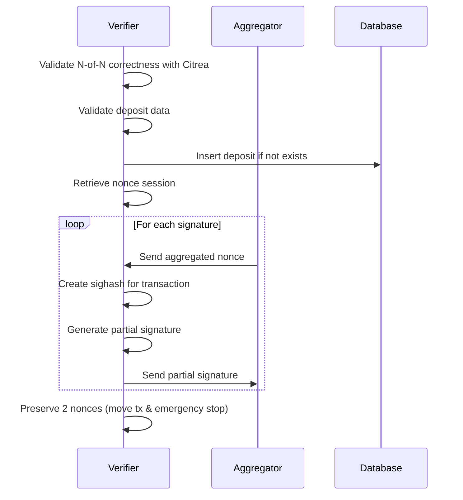
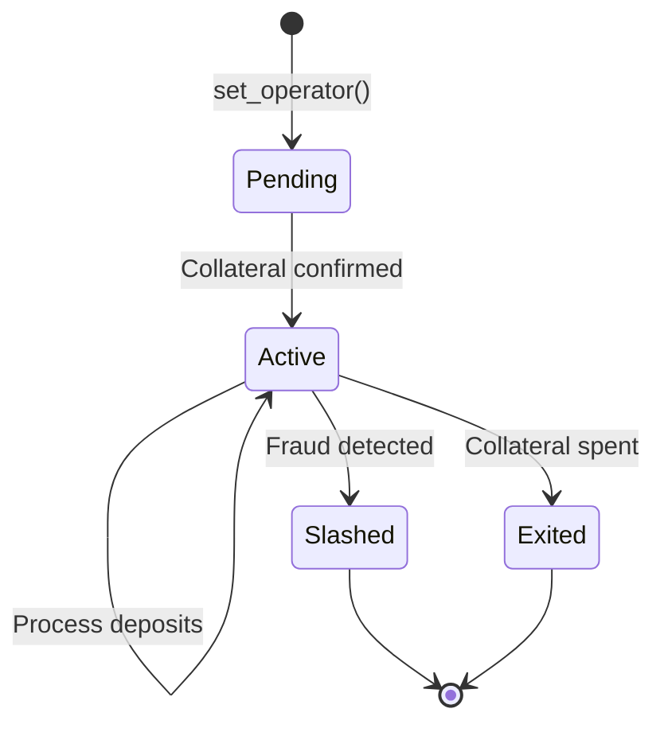
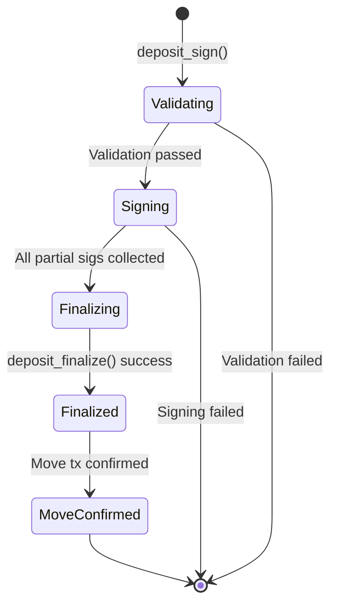

Verifiers are responsible for validating deposits and providing partial signatures for N-of-N multisig transactions. They ensure the security of the bridge by collectively signing all bridge transactions.

## Architecture

```rust
pub struct Verifier<C: CitreaClientT> {
    rpc: ExtendedBitcoinRpc,
    signer: Actor,
    db: Database,
    config: BridgeConfig,
    nonces: Arc<tokio::sync::Mutex<AllSessions>>,
    tx_sender: TxSenderClient<Database>,
    header_chain_prover: HeaderChainProver,
    citrea_client: C,
}
```

### Key Components

- **Bitcoin RPC**: Monitors Bitcoin blockchain for deposits
- **Signer**: Actor instance for cryptographic operations
- **Database**: Stores operator keys, deposit data, and signatures
- **Nonce Sessions**: Manages MuSig2 nonces for parallel signing
- **Citrea Client**: Validates N-of-N public key correctness

## Core Responsibilities

### 1. Operator Registration

Verifiers accept operators into the protocol via `set_operator()`:

<Steps>
  <Step title="Validate Collateral">
    Check that the operator's collateral UTXO exists on-chain and contains the correct amount
  </Step>
  <Step title="Verify Kickoff Signatures">
    Validate all unspent kickoff signatures for every round transaction
    ```rust
    fn verify_unspent_kickoff_sigs(
        &self,
        collateral_funding_outpoint: OutPoint,
        operator_xonly_pk: XOnlyPublicKey,
        wallet_reimburse_address: Address,
        unspent_kickoff_sigs: Vec<Signature>,
        kickoff_wpks: &KickoffWinternitzKeys,
    ) -> Result<Vec<TaggedSignature>, BridgeError>
    ```
  </Step>
  <Step title="Store Operator Data">
    Save operator public keys, Winternitz public keys, and signatures to database
  </Step>
  <Step title="Initialize State Machine">
    Dispatch a new round state machine for automated monitoring (automation feature only)
  </Step>
</Steps>

### 2. Deposit Validation

Before signing any deposit, verifiers perform comprehensive validation:

#### Security Council Check

```rust
if deposit_data.security_council != self.config.security_council {
    return Err(BridgeError::InvalidDeposit("Security council mismatch"));
}
```

#### Watchtower Limits

- Maximum extra watchtowers: `MAX_EXTRA_WATCHTOWERS`
- Total watchtowers cannot exceed `MAX_NUMBER_OF_WATCHTOWERS`

#### Uniqueness Validation

- All verifiers must be unique
- All watchtowers must be unique  
- All operators must be unique

#### Operator Verification

For each operator in the deposit:

1. Check if operator exists in verifier's database
2. Verify collateral UTXO is still unspent on-chain
3. Ensure operator is not included if collateral was spent
4. Reject deposit if unknown operators are included

#### Script Validation

```rust
let expected_scriptpubkey = create_taproot_address(
    &deposit_scripts,
    None,
    self.config.protocol_paramset().network,
).0.script_pubkey();

if deposit_txout_in_chain.script_pubkey != expected_scriptpubkey {
    return Err(BridgeError::InvalidDeposit("Script mismatch"));
}
```

#### Amount and Confirmation Checks

- Deposit amount must match `bridge_amount` from protocol parameters
- Deposit must be confirmed in a block at height ≥ `start_height`

### 3. Nonce Generation

Verifiers generate nonces for MuSig2 signing:

```rust
pub async fn nonce_gen(
    &self,
    num_nonces: u32,
) -> Result<(u128, Vec<PublicNonce>), BridgeError>
```

**Process**:

1. Validate `num_nonces ≤ NUM_NONCES_LIMIT`
2. Generate secret and public nonce pairs using MuSig2
3. Create a nonce session with random ID
4. Add session to `AllSessions` (evicting oldest if needed)
5. Return session ID and public nonces

**Session Management**:

- Sessions are stored in a HashMap with random 128-bit IDs
- Maximum total byte size: `MAX_ALL_SESSIONS_BYTES`
- Maximum number of sessions: `MAX_NUM_SESSIONS`
- Old sessions are evicted FIFO when limits are exceeded

### 4. Deposit Signing

Verifiers provide partial signatures for all deposit transactions:

```rust
pub async fn deposit_sign(
    &self,
    deposit_data: DepositData,
    session_id: u128,
    agg_nonce_rx: mpsc::Receiver<AggregatedNonce>,
) -> Result<mpsc::Receiver<Result<PartialSignature, BridgeError>>, BridgeError>
```

**Workflow**:



**Number of Signatures**:

- N-of-N signatures for all kickoff transactions
- Signatures for each operator's challenge transactions  
- Signatures for slash/take transactions
- Additional signatures for move transaction and emergency stop

### 5. Deposit Finalization

After all partial signatures are collected:

```rust
pub async fn deposit_finalize(
    &self,
    deposit_data: &mut DepositData,
    session_id: u128,
    sig_receiver: mpsc::Receiver<Signature>,
    agg_nonce_receiver: mpsc::Receiver<AggregatedNonce>,
    operator_sig_receiver: mpsc::Receiver<Signature>,
) -> Result<(PartialSignature, PartialSignature), BridgeError>
```

**Verification Process**:

1. **Verify N-of-N Signatures**
   - Stream sighashes for all transactions
   - Receive aggregated signatures from aggregator
   - Verify each signature against expected sighash
   - Store valid signatures in database

2. **Verify Operator Signatures**
   - For each operator, generate sighash stream
   - Receive signatures from aggregator
   - Verify signatures match operator's public key
   - Tag and store signatures by transaction type

3. **Sign Move Transaction**
   - Receive aggregated nonce for move tx
   - Calculate sighash for deposit → vault movement
   - Generate partial signature using preserved nonce

4. **Sign Emergency Stop**
   - Receive aggregated nonce for emergency stop
   - Calculate sighash with `SinglePlusAnyoneCanPay`
   - Generate partial signature

5. **Persist to Database**
   - Save all verified signatures
   - Store kickoff transaction IDs
   - Mark deposit as finalized

**Return Value**: `(move_tx_partial_sig, emergency_stop_partial_sig)`

## Background Tasks (Automation)

<Note>
The following features are only available when compiled with the `automation` feature flag.
</Note>

### State Manager

Monitors operator state transitions:

- Tracks operator round progression
- Detects when operators end rounds
- Monitors kickoff transaction confirmations
- Triggers automated responses

### Transaction Sender

Automatically broadcasts signed transactions:

- Manages RBF (Replace-By-Fee) logic
- Handles CPFP (Child-Pays-For-Parent) fee bumping
- Retries failed broadcasts
- Monitors mempool and confirmation status

### Bitcoin Syncer

Maintains a view of Bitcoin blockchain:

- Syncs blocks from Bitcoin node
- Stores block headers for SPV proofs
- Updates deposit confirmation status
- Triggers state changes on confirmations

### Finalized Block Fetcher

Processes blocks once they reach finality depth:

- Reads from database consumer queue
- Processes deposits at finality threshold
- Triggers reimbursement flows
- Updates operator collateral status

### Entity Metric Publisher

Publishes metrics about verifier health:

- Wallet balance
- Sync status (Bitcoin tip vs local)
- Transaction sender queue depth
- State manager progress

## State Transitions

### Operator Lifecycle



### Deposit Lifecycle



## Database Schema

Verifiers maintain several key tables:

### `operators`

- `xonly_pk`: Operator's X-only public key
- `reimburse_addr`: Address for operator reimbursement  
- `collateral_funding_outpoint`: UTXO locking operator's collateral

### `operator_kickoff_winternitz_pks`

- `operator_xonly_pk`: Foreign key to operators
- `winternitz_pks`: Serialized vector of Winternitz public keys

### `deposits`

- `deposit_outpoint`: Unique identifier
- `deposit_data`: Serialized DepositData
- `status`: Pending, Signed, Finalized, Confirmed

### `signatures`

- `deposit_id`: Foreign key to deposits
- `signature_id`: Identifies which transaction input
- `signature`: 64-byte Schnorr signature
- `operator_idx`, `round_idx`, `kickoff_idx`: Indexing fields

## Error Handling

### Deposit Validation Errors

```rust
pub enum BridgeError {
    InvalidDeposit(String),
    OperatorNotFound(XOnlyPublicKey),
    CollateralNotUsable,
    // ...
}
```

When validation fails:
- Error message includes detailed reason
- Deposit is NOT stored in database
- No signatures are generated
- Aggregator is notified of failure

### Signature Verification Errors

If a signature from the aggregator fails verification:
- Log the specific signature that failed
- Include sighash and public key in error
- Stop processing immediately
- Do not store any signatures from this deposit

## Security Properties

### Deposit Validation

✅ **Prevents**:
- Signing for unknown operators
- Accepting deposits with spent collateral
- Processing deposits with invalid scripts
- Signing before sufficient confirmations

### Nonce Management

✅ **Prevents**:
- Nonce reuse across sessions
- Memory exhaustion from unlimited sessions
- Nonce prediction via sequential IDs

### Signature Safety

✅ **Ensures**:
- All signatures are verified before storage
- Correct tweak data is used (key path vs script path)
- Signatures match expected transactions
- No signature is used in multiple contexts

## Related Documentation

<CardGroup cols={2}>
  <Card title="Actor Overview" icon="diagram-project" href="/actors/overview">
    Learn about the actor model architecture
  </Card>
  <Card title="Operator" icon="gears" href="/actors/operator">
    Understand how operators work with verifiers
  </Card>
  <Card title="Aggregator" icon="network-wired" href="/actors/aggregator">
    See how aggregators coordinate verifiers
  </Card>
</CardGroup>
