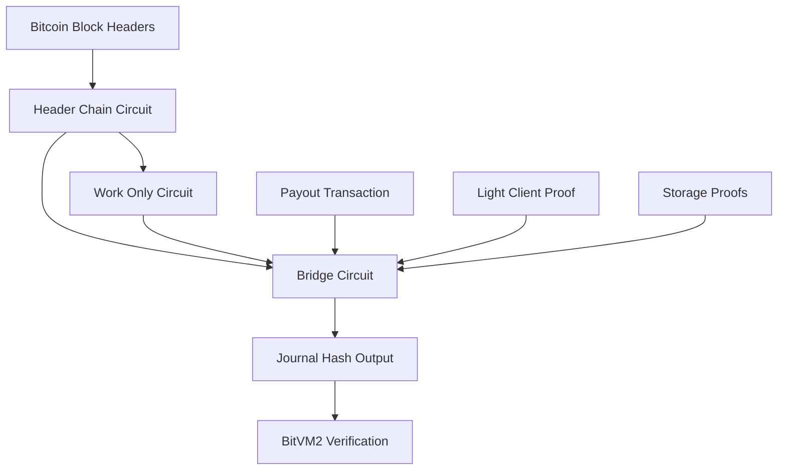

Clementine uses a suite of zero-knowledge (ZK) circuits to enable trust-minimized cross-chain operations between Bitcoin and Citrea L2. These circuits leverage RISC Zero's zkVM to verify complex cryptographic computations while maintaining Bitcoin's security guarantees.

## Circuit Architecture

The circuit system consists of three primary components that work together to verify peg-out operations:

1. **[Header Chain Circuit](/circuits/header-chain-circuit)** - Verifies Bitcoin block header chain continuity and proof-of-work
2. **[Work Only Circuit](/circuits/work-only-circuit)** - Extracts and compresses accumulated proof-of-work data
3. **[Bridge Circuit](/circuits/bridge-circuit)** - Orchestrates all verifications for secure peg-out operations

## How Circuits Enable Trust Minimization

Traditional Bitcoin bridges require trusted intermediaries to validate cross-chain operations. Clementine eliminates this trust assumption by using zero-knowledge proofs to cryptographically verify:

- **Bitcoin Chain State**: Operators must prove they're following the canonical Bitcoin chain with the most accumulated work
- **Transaction Inclusion**: Payout transactions are cryptographically verified to exist in specific Bitcoin blocks
- **Watchtower Challenges**: Independent watchtowers can challenge operators by submitting competing proofs
- **L2 State Consistency**: Bridge operations are verified against Citrea's rollup state

## BitVM2 Integration

The circuits integrate with BitVM2 to enable verification on Bitcoin without requiring protocol changes:

<Steps>
  <Step title="Off-Chain Execution">
    The Operator executes circuits off-chain and generates zero-knowledge proofs (Groth16 format)
  </Step>
  
  <Step title="On-Chain Commitment">
    The Operator commits proof results on-chain via the KickOff transaction using Winternitz One-Time Signatures (WOTS)
  </Step>
  
  <Step title="Challenge Period">
    Challengers can verify the proof computation and initiate disputes if errors are detected
  </Step>
  
  <Step title="Dissection Game">
    BitVM2 facilitates a binary search process to identify the exact computational step in dispute
  </Step>
  
  <Step title="On-Chain Verification">
    Only the disputed step is executed on-chain within Bitcoin Script constraints
  </Step>
</Steps>

## Proof Systems

Clementine uses two complementary proof systems:

### RISC Zero zkVM

The primary proof system for circuit execution:

- **Recursive Proofs**: Header chain proofs can verify previous proofs, enabling verification of arbitrarily long chains
- **Method IDs**: Each circuit has a unique identifier ensuring proof compatibility across network types (mainnet, testnet, regtest)
- **Network-Specific Builds**: Circuits are compiled with network-specific constants for proper validation

### Groth16 Proofs

Used for compact on-chain verification:

- **Compressed Format**: 128-byte proofs enable efficient Bitcoin Script verification
- **Watchtower Commitments**: Watchtowers submit Groth16 proofs of their work-only circuit outputs
- **Verification Keys**: Pre-computed verification keys are embedded in Bitcoin Script for on-chain validation

<Accordion title="Technical: Groth16 Proof Structure">
  Groth16 proofs consist of three elliptic curve points:
  
  - **Point A**: Proof element verifying witness computation
  - **Point B**: Proof element (G2 curve point) for pairing check
  - **Point C**: Proof element ensuring constraint satisfaction
  
  The compressed 128-byte format encodes these points efficiently for Bitcoin Script verification.
</Accordion>

## Circuit Data Flow

## Network Configuration

Circuits adapt their verification logic based on the Bitcoin network:

<CardGroup cols={2}>
  <Card title="Mainnet" icon="bitcoin">
    Standard Bitcoin difficulty rules with 2-week adjustment periods
  </Card>
  <Card title="Testnet4" icon="flask">
    Emergency difficulty reduction after 20-minute block gaps
  </Card>
  <Card title="Signet" icon="network-wired">
    Custom 10-second block time with adjusted difficulty parameters
  </Card>
  <Card title="Regtest" icon="hammer">
    Minimal difficulty for local testing, no difficulty adjustments
  </Card>
</CardGroup>

Network type is configured at compile time via the `BITCOIN_NETWORK` environment variable.

## Key Files

The circuit implementation is organized across several directories:

- **`risc0-circuits/`** - RISC Zero guest programs and build configuration
  - `bridge-circuit/` - Bridge circuit implementation
  - `header-chain/` - Header chain verification
  - `work-only/` - Work extraction circuit
- **`circuits-lib/`** - Shared circuit logic and utilities
  - `src/bridge_circuit/` - Bridge verification logic
  - `src/header_chain/` - Bitcoin header validation
  - `src/work_only/` - Work conversion utilities

## Next Steps

<CardGroup cols={3}>
  <Card title="Header Chain" icon="link" href="/circuits/header-chain-circuit">
    Learn about Bitcoin header chain verification
  </Card>
  <Card title="Work Only" icon="chart-line" href="/circuits/work-only-circuit">
    Understand proof-of-work extraction
  </Card>
  <Card title="Bridge Circuit" icon="bridge" href="/circuits/bridge-circuit">
    Explore the complete bridge verification logic
  </Card>
</CardGroup>