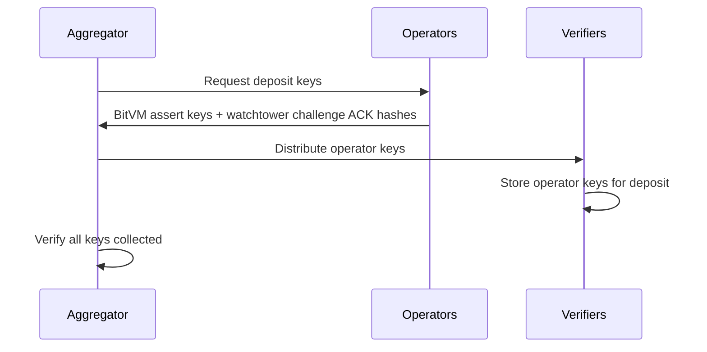

The deposit flow, also known as the peg-in process, allows users to transfer Bitcoin from the Bitcoin blockchain to Citrea L2. This process involves multiple participants working together through a trust-minimized protocol.

## Overview

Deposits are finalized through a three-step MuSig2 signature aggregation process coordinated by the aggregator. The process ensures that all verifiers collaboratively sign transactions without any single party having control over the funds.

## Participants

### Verifiers (Signers)
- Hold partial signing keys in an N-of-N multisignature setup
- Generate nonces and partial signatures for deposit transactions
- Participate in MuSig2 aggregation protocol
- Validate deposit scripts and security requirements

### Aggregator
- Coordinates the signature aggregation process
- Collects nonces from all verifiers
- Distributes aggregated nonces back to verifiers
- Aggregates partial signatures into final signatures
- Creates the move transaction

### Operators
- Provide withdrawal infrastructure (kickoff UTXOs)
- Supply BitVM assert data and watchtower challenge acknowledgment hashes
- Receive collateral funding requirements

### Watchtowers
- Monitor operator behavior
- Provide Winternitz public keys for challenge mechanisms
- Verifiers automatically act as watchtowers

## Deposit Types

### Base Deposit

Created by users who want to bridge Bitcoin to Citrea L2.

**Required data:**
- User's EVM address (destination on Citrea)
- Recovery taproot address (for timelock recovery)
- Deposit outpoint (Bitcoin UTXO)

**Script requirements:**
- Base deposit script with N-of-N aggregated public key and EVM address
- Timelock script allowing user recovery after `user_takes_after` blocks

### Replacement Deposit

Created by the security council to migrate funds to a new deposit structure (e.g., bug fixes or upgrades).

**Required data:**
- Old move transaction ID being replaced
- Security council M-of-N multisig parameters

**Script requirements:**
- Replacement deposit script referencing the old move txid
- Security council multisig script for emergency unlocking

## Three-Step MuSig2 Process

<Steps>
  <Step title="Nonce Aggregation">
    Each verifier generates a nonce pair (secret and public) for the deposit transaction.
    
    The aggregator:
    1. Collects public nonces from all verifiers
    2. Aggregates nonces using MuSig2 protocol
    3. Sends the aggregated nonce back to all verifiers
    
    **Security note:** Nonces must never be reused, as reuse can leak private keys.
  </Step>
  
  <Step title="Signature Aggregation">
    With the aggregated nonce, verifiers create partial signatures.
    
    The aggregator:
    1. Requests partial signatures from all verifiers for the aggregated nonce
    2. Each verifier creates a partial signature for the move transaction
    3. Aggregates partial signatures using MuSig2
    4. Verifies the final Schnorr signature
    5. Sends the final signature to verifiers
    
    **Verification:** The aggregator verifies the aggregated signature against the aggregated public key before distribution.
  </Step>
  
  <Step title="Move Transaction Creation">
    Verifiers use the aggregated signatures to finalize the deposit.
    
    The aggregator:
    1. Receives move transaction partial signatures from verifiers
    2. Aggregates the move tx signatures
    3. Creates the final move transaction
    4. Broadcasts the transaction to the Bitcoin network (if automation is enabled)
    
    The move transaction transfers funds from the deposit UTXO to the bridge vault, making them available for withdrawals.
  </Step>
</Steps>

## Key Collection and Distribution

Before deposit finalization, the aggregator orchestrates key collection:

The aggregator collects from operators:
- BitVM Winternitz public keys for assert transactions
- Watchtower challenge acknowledgment hashes
- Round transaction data

## N-of-N Security Model

### Why N-of-N?

Funds stay in an N-of-N setup, which differs from traditional M-of-N multisig:

- **Key Deletion Covenant**: Functions as a covenant restricting how UTXOs can be spent
- **Security Guarantee**: Funds remain safe as long as at least one signer's key is secure
- **Liveness Guarantee**: System remains operational as long as at least one operator participates

### Security Council Backup

The Bridge Contract maintains a separate M-of-N multisig that can:
- Update the N-of-N signer set if needed
- Subject to time restrictions (e.g., one month for updates)
- Allows participants to exit if they don't trust new signers

### Advantages Over M-of-N

- **Stronger Security**: Existing deposits remain protected by original N-of-N covenant
- **Upgrade Path**: New deposits can use updated signer sets
- **Exit Window**: Time-delayed updates allow users to withdraw if concerned

## Deposit Validation

Verifiers validate deposits by checking:

1. **Script Correctness**
   - Deposit address contains required taproot scripts
   - N-of-N aggregated public key matches verifier set
   - Recovery timelock uses correct parameters

2. **Actor Uniqueness**
   - All verifiers have unique public keys
   - All watchtowers have unique public keys
   - All operators have unique public keys

3. **Security Council Configuration**
   - Threshold ≤ number of public keys
   - Public keys are valid X-only public keys
   - Order is preserved (affects multisig script)

## Database Persistence

Deposit data is stored in PostgreSQL including:
- Deposit outpoint and type
- Actor public keys (verifiers, operators, watchtowers)
- Security council configuration
- Cached N-of-N aggregated public key
- Move transaction ID

## Related Endpoints

- `POST /api/v1/deposit` - Submit new deposit
- `GET /api/v1/deposit/{txid}` - Query deposit status
- `GET /verifier/params` - Get verifier public key
- `GET /operator/xonly_public_key` - Get operator public key

## Code References

- Deposit data structures: `core/src/deposit.rs`
- MuSig2 implementation: `core/src/musig2.rs`
- Aggregator coordination: `core/src/aggregator.rs`
- Move transaction creation: `core/src/builder/transaction/deposit_signature_owner.rs`