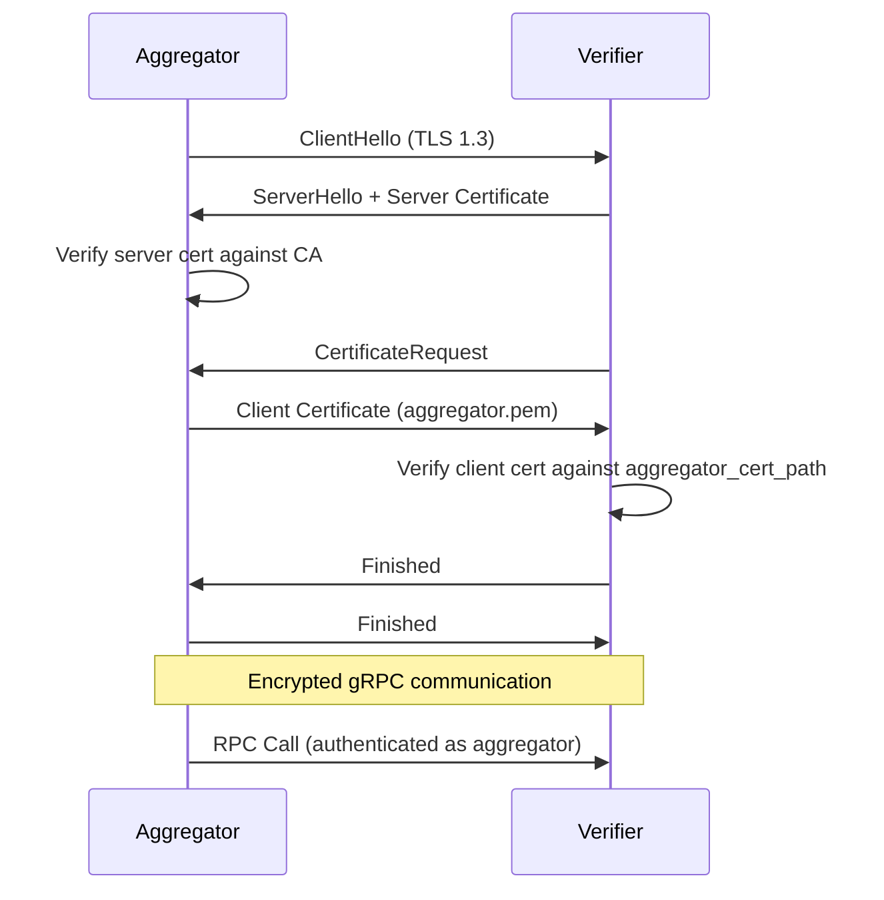

Clementine uses mutual TLS (mTLS) to secure gRPC communications between entities and authenticate clients. This ensures only authorized entities can invoke specific RPC methods.

## Authentication Model

Clementine implements a role-based authentication model where different certificates grant different access levels.

### Certificate Roles

| Certificate | Purpose | Access Level |
|------------|---------|-------------|
| **CA Certificate** | Root of trust for all certificates | Signs all entity certificates |
| **Server Certificate** | TLS encryption for gRPC servers | Enables encrypted connections |
| **Client Certificate** | Entity's internal method authentication | Internal RPC methods only |
| **Aggregator Certificate** | Aggregator's authenticated access | Verifier and operator methods |

### Access Control Rules

**Verifier/Operator Services**:
1. Verifier/Operator methods can only be called by the aggregator using `aggregator_cert_path`
2. Internal methods can only be called by the entity's own client using `client_cert_path`

**Aggregator Service**:
- Does not enforce client certificate authentication
- Uses TLS for encryption only
- Verifiers and operators connect without client certificates

## Certificate Generation

### Automated Script

Clementine provides a script to generate all required certificates for testing:

```bash
# Run from project root
./scripts/generate_certs.sh
```

### Generated Directory Structure

```
core/certs/
├── ca/
│   ├── ca.key           # CA private key (keep secure!)
│   └── ca.pem           # CA certificate (public)
├── server/
│   ├── ca.pem           # Copy of CA cert
│   ├── server.key       # Server private key
│   └── server.pem       # Server certificate
├── client/
│   ├── ca.pem           # Copy of CA cert
│   ├── client.key       # Client private key
│   └── client.pem       # Client certificate
└── aggregator/
    ├── ca.pem           # Copy of CA cert
    ├── aggregator.key   # Aggregator private key
    └── aggregator.pem   # Aggregator certificate
```

## Certificate Generation Steps

The script performs the following operations:

<Steps>
  <Step title="Create Certificate Authority (CA)">
    Generates a self-signed CA certificate:
    
    ```bash
    openssl genrsa -out ca.key 4096
    openssl req -new -x509 -sha256 -days 365 \
      -key ca.key -out ca.pem \
      -subj "/C=US/ST=California/L=San Francisco/O=Clementine/OU=CA/CN=clementine-ca" \
      -extensions v3_ca
    ```
    
    The CA will sign all other certificates, establishing the trust chain.
  </Step>
  
  <Step title="Generate Server Certificate">
    Creates server certificate for TLS encryption:
    
    ```bash
    # Generate private key
    openssl genrsa -out server.key 2048
    
    # Create certificate signing request (CSR)
    openssl req -new -key server.key -out server.csr \
      -subj "/C=US/ST=California/L=San Francisco/O=Clementine/OU=Server/CN=localhost"
    
    # Sign with CA
    openssl x509 -req -sha256 -days 365 \
      -in server.csr -CA ca.pem -CAkey ca.key \
      -out server.pem -extensions v3_req
    ```
    
    Includes Subject Alternative Names (SANs) for:
    - `localhost`
    - `*.docker.internal`
    - `127.0.0.1`
    - `172.17.0.1`
  </Step>
  
  <Step title="Generate Client Certificate">
    Creates entity-owned client certificate:
    
    ```bash
    # Generate private key
    openssl genrsa -out client.key 2048
    
    # Create CSR
    openssl req -new -key client.key -out client.csr \
      -subj "/C=US/ST=California/L=San Francisco/O=Clementine/OU=Client/CN=clementine-client"
    
    # Sign with CA
    openssl x509 -req -sha256 -days 365 \
      -in client.csr -CA ca.pem -CAkey ca.key \
      -out client.pem -extensions v3_req
    ```
  </Step>
  
  <Step title="Generate Aggregator Certificate">
    Creates aggregator's privileged certificate:
    
    ```bash
    # Generate private key
    openssl genrsa -out aggregator.key 2048
    
    # Create CSR
    openssl req -new -key aggregator.key -out aggregator.csr \
      -subj "/C=US/ST=California/L=San Francisco/O=Clementine/OU=Aggregator/CN=clementine-aggregator"
    
    # Sign with CA
    openssl x509 -req -sha256 -days 365 \
      -in aggregator.csr -CA ca.pem -CAkey ca.key \
      -out aggregator.pem -extensions v3_req
    ```
  </Step>
  
  <Step title="Distribute Certificates">
    The script copies CA certificate to all directories:
    
    ```bash
    cp ca.pem server/
    cp ca.pem client/
    cp ca.pem aggregator/
    ```
    
    This allows each component to verify the authenticity of other certificates.
  </Step>
</Steps>

## Configuration

### Verifier/Operator Configuration

```toml
# Server TLS configuration
server_cert_path = "core/certs/server/server.pem"
server_key_path = "core/certs/server/server.key"
ca_cert_path = "core/certs/ca/ca.pem"

# Client certificate for internal methods
client_cert_path = "core/certs/client/client.pem"
client_key_path = "core/certs/client/client.key"

# Aggregator certificate for verification
aggregator_cert_path = "core/certs/aggregator/aggregator.pem"
```

### Aggregator Configuration

```toml
# Server TLS configuration (no client cert enforcement)
server_cert_path = "core/certs/server/server.pem"
server_key_path = "core/certs/server/server.key"
ca_cert_path = "core/certs/ca/ca.pem"

# Aggregator's own certificate for connecting to operators/verifiers
aggregator_cert_path = "core/certs/aggregator/aggregator.pem"
aggregator_key_path = "core/certs/aggregator/aggregator.key"
```

### Environment Variables

Certificate paths can also be configured via environment variables:

```bash
export SERVER_CERT_PATH="/path/to/server.pem"
export SERVER_KEY_PATH="/path/to/server.key"
export CA_CERT_PATH="/path/to/ca.pem"
export CLIENT_CERT_PATH="/path/to/client.pem"
export CLIENT_KEY_PATH="/path/to/client.key"
export AGGREGATOR_CERT_PATH="/path/to/aggregator.pem"
export AGGREGATOR_KEY_PATH="/path/to/aggregator.key"
```

## mTLS Handshake Flow



## Security Best Practices

### Development vs. Production

**Development/Testing**:
- ✅ Use script-generated self-signed certificates
- ✅ Automatic generation if certificates missing
- ✅ localhost and Docker networking support

**Production**:
- ⚠️ Use certificates from a trusted Certificate Authority
- ⚠️ Never use self-signed certificates
- ⚠️ Implement certificate rotation policy
- ⚠️ Use proper DNS names (not IP addresses)

### Private Key Security

<Warning>
  **Never commit private keys to version control!**
  
  Ensure `.gitignore` includes:
  ```
  core/certs/**/*.key
  ```
</Warning>

**Key protection measures**:
- Store private keys with restricted permissions: `chmod 600 *.key`
- Use separate keys per environment (dev, staging, production)
- Rotate keys regularly (e.g., every 90 days)
- Consider hardware security modules (HSMs) for production
- Encrypt keys at rest using secrets management systems

### Certificate Rotation

<Steps>
  <Step title="Generate New Certificates">
    Create new certificates before old ones expire:
    
    ```bash
    ./scripts/generate_certs.sh
    # Or manually generate with longer validity:
    openssl x509 -req -sha256 -days 730 ...
    ```
  </Step>
  
  <Step title="Distribute to Entities">
    Securely transfer new certificates to all running entities:
    
    ```bash
    # Copy to deployment locations
    scp certs/server/* user@verifier1:/etc/clementine/certs/
    scp certs/aggregator/* user@aggregator:/etc/clementine/certs/
    ```
  </Step>
  
  <Step title="Update Configuration">
    Update configuration files to point to new certificates:
    
    ```toml
    server_cert_path = "/etc/clementine/certs/server-new.pem"
    ```
  </Step>
  
  <Step title="Restart Services">
    Restart services to load new certificates:
    
    ```bash
    systemctl restart clementine-verifier
    systemctl restart clementine-aggregator
    ```
  </Step>
  
  <Step title="Verify Connectivity">
    Test gRPC connections work with new certificates:
    
    ```bash
    grpcurl -cacert ca.pem \
      -cert client.pem -key client.key \
      localhost:50051 list
    ```
  </Step>
</Steps>

### Network Security

**Firewall Rules**:
- Restrict gRPC ports (default 50051) to known IP ranges
- Use VPNs or private networks for entity communication
- Block public access to verifier/operator ports

**Additional Protections**:
- Enable rate limiting on gRPC endpoints
- Monitor certificate expiration dates
- Log all authentication failures
- Implement intrusion detection systems

## Troubleshooting

### Certificate Verification Failed

```
Error: certificate verify failed: unable to get local issuer certificate
```

**Solution**: Ensure CA certificate path is correct and CA cert matches signing authority.

```bash
# Verify certificate chain
openssl verify -CAfile ca.pem server.pem
```

### Client Certificate Rejected

```
Error: RPC failed: PermissionDenied: Invalid client certificate
```

**Solution**: 
1. Check `aggregator_cert_path` matches aggregator's certificate
2. Verify certificate hasn't expired
3. Ensure certificate was signed by the correct CA

```bash
# Check certificate validity
openssl x509 -in aggregator.pem -noout -dates
```

### Certificate Expired

```
Error: certificate has expired
```

**Solution**: Regenerate certificates with longer validity or implement rotation process.

```bash
# Check expiration date
openssl x509 -in server.pem -noout -enddate
```

### Hostname Verification Failed

```
Error: Hostname verification failed
```

**Solution**: Ensure server certificate includes correct SANs for your deployment.

```bash
# View certificate SANs
openssl x509 -in server.pem -noout -text | grep -A1 "Subject Alternative Name"
```

## Code References

- Certificate generation script: `scripts/generate_certs.sh`
- gRPC server setup: `core/src/rpc/`
- Client authentication: `core/src/rpc/aggregator.rs`
- Configuration parsing: `core/src/config/`